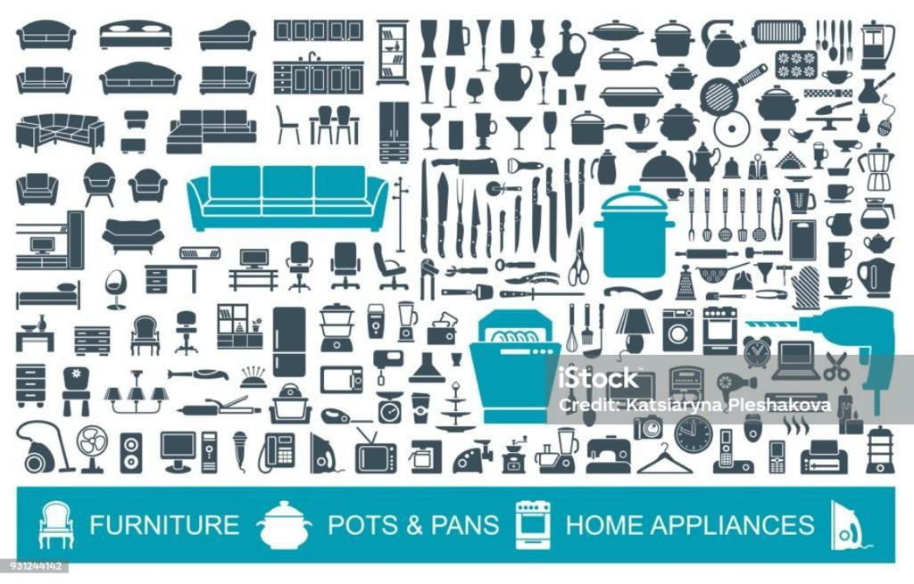
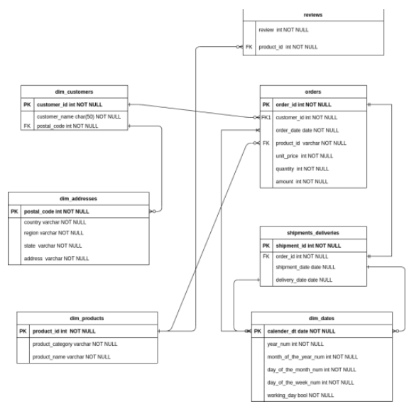
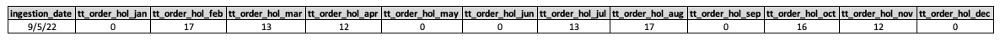
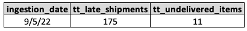
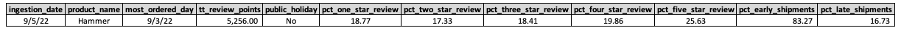
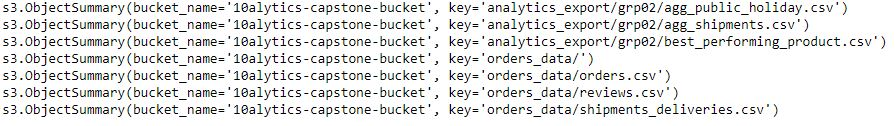

# Data-Engineering-Capstone-Project-for-Norby-Inc

## Overview
Norby Inc. is a multinational company that deals in household items. The business stakeholders require the service of the Data Engineering team to build a robust ELT pipeline for ABC.com

The goal was to provide the company with some analysis related to orders, reviews, and shipments to derive insight and help the company make data-driven decisions.

## Data Modelling
Below is the Entity Relationship Diagram (ERD) showing the data model of the data warehouse.

The attached ER diagram has been provided. It shows the relationship between the table.

The Order table is the fact table.

The product table,dim_customer table, calendar date table, review table, and shipment table are all connected to the fact table.

The schema used is called a star schema.

## Required Tasks
Norby Inc. would like to know the following:

- The total number of orders placed on a public holiday every month, for the past year.
- Total number of late shipments.
- Total number of undelivered shipments.
- The product with the highest reviews, the day it was ordered the most, whether that day was a public holiday, total review points, percentage distribution of the review points, and percentage distribution of early shipments to late shipments for that particular product.
 **_Glossary_** :

_1. A public holiday is a day with a day_of_the_week number in the range of 1 - 5 and a working_day value of false._

_2. A late shipment is one with shipment_date greater than or equal to 6 days after the order_date and delivery_date is NULL._

_3. An undelivered shipment is one with delivery_date as NULL,shipment_date as NULL, and the current_date 15 days after order_date._

## Data Source (Data Lake using Amazon S3)
Our first step was connecting to a data lake hosted on Amazon S3 containing three (3) fact tables:

- Order
- Review
- Shipments

_Data lake is like a giant storage bucket in the cloud. In this bucket, ABC.com has stored data in the form of CSV files. Think of CSV files as spreadsheets with rows and columns. We used a Python library called boto3 to access and retrieve these files from the S3 bucket. Once we had the data, we loaded it into Pandas DataFrames. Think of DataFrames as virtual spreadsheets that can be manipulated using code_.

We connected to our s3 Bucket using the details below to retrieve the data:

**Bucket Name**: 10alytics-capstone-bucket **Data Locations**: s3://10alytics-capstone-bucket/orders_data/*

This directory contains the following files:

- orders.csv: This data is a fact table about orders gotten on our website Norby Inc.
- reviews.csv: This data is a fact table on reviews given for a particular delivered product
- shipments_deliveries.csv: This is a fact table on shipments and their delivery dates
 
The Dimension data were already loaded into the Data warehouse which is a Postgres database. These are listed below:

- dim_customers
- dim_addresses
- dim_products
- dim_dates
The dim_* tables are loaded into the if_common schema. For example, I can access the dim_customers table with if_common.dim_customers.

## Tools & Techniques
- Jupyter Notebook (Python)
- Amazon s3 Bucket
- PostgreSQL
- SQLAlchemy
- Boto3 Library
- Data Transformation using advanced-level SQL queries (Subquery, CTE etc)
- Data Modelling
- Data Pipeline
- Libraries

We used several tools to accomplish our tasks, including pandas (a data manipulation library), io (for handling input and output streams), sqlalchemy (for database connection), and boto3 (to interact with Amazon S3, where data was stored).

## Data Warehouse Connection
To centralize and organize the data for analysis, we connected to a data warehouse. Think of a data warehouse as a big, well-organized database. We used SQLAlchemy, which is like a bridge between Python code and the database. To connect, we provided credentials like a username, password, and details about where the database is located.

## Data Loading
With the connection in place, we loaded the data from our Pandas DataFrames into the data warehouse. Think of this step as moving information from spreadsheets into a massive digital filing cabinet. We also specified exactly where in the filing cabinet (schema) the data should be stored.

## Tasks 
Our main job was to answer specific questions using the data. Here is what we found:

## Requirement 1: Total Number of Orders Placed on Public Holidays Every Month
We created SQL queries (special code for databases) to count how many orders were made on public holidays each month over the past year. This helps Norby Inc. understand customer behavior during holidays.

## Requirement 2: Total Number of Late Shipments and Undelivered Shipments
Using more SQL queries, we figured out how many shipments were late (took too long to arrive) and how many shipments never arrived at all. This is crucial for measuring the quality of Norby Inc.'s delivery service.

## Requirement 3: Analysis of Best Performing Product
We went even further by analyzing the best-performing product. We considered how many points it got in customer reviews, the day it was ordered the most, and whether that day happened to be a public holiday or not. We also calculated the percentages of different review scores and the percentages of shipments that were early or late for this product.

The analysis derived was loaded into the company's S3 bucket as seen below. 

## Conclusion
In the end, we successfully completed the Data Engineering Capstone Project for ABC.com. This project involved technical tasks like extracting data from a cloud storage bucket, connecting to a database, and writing complex queries. But it was all done to help ABC.com. understand its business better, especially when it comes to customer behavior, shipment quality, and product performance. The insights gained from this project can guide ABC.com in making smarter decisions for their future.

## Project Team Members
- Arowolo Oluseyi Victor
- Boniface Chijioke
- Oluwatosin Abigeal Oshuntolu
- Taiwo Adegbayi
- Michael Oseyemi
